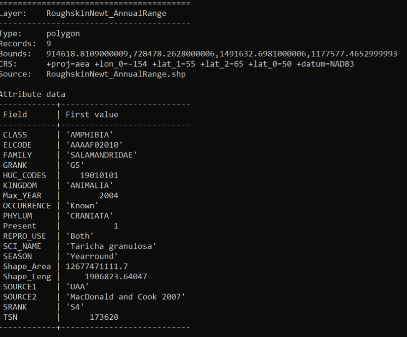

# DistributionBufferForAmphibiaOfAlaska

 A Repo created to explore usage of node and turf.js focusing on the distribution and proposed buffer zones of Rough Skin Newts for Alaska. Further data was used to determine if their buffered habitat is more likely to be impacted by observed damage caused by Spruce Broom Rust or a Spruce Beetle based on proximity to layers.

## TOC
- [Data](#Data)
    - [Exploration](#Exploration)
    - [Processing](#Processing)
        - [CSV Processing](#CSV-Processing)
        - [Amphibia Files](#Amphibia-Files)

## Data
Amphibian data originally pulled from [Alaska Center for Conservation Science University of Alaska Anchorage](http://akgap.uaa.alaska.edu/species-data/) on 2021-11-20. Downloaded zipped folders and explored the shapefile for 

- RoughskinNewt_AnnualRange (8.38 KB)

Locations of damaged forests caused by insect, disease and other abiotic agents pulled from [IDS Points U.S. Forest Service](https://gis.data.alaska.gov/search?collection=Dataset&q=point) on 2021-11-20. Downloaded zipped folder for points and explored the shapefile (89.1 MB)

### Exploration
Initial Exploration of Files in command module using ogrinfo

- RoughskinNewt_AnnualRange 
    - DBF_DATE_LAST_UPDATE=2015-05-21
    - Geometry: Polygon
    - Feature Count: 9
    - PROJCRS NAD83/Alaska Albers
    - 19 attributes (HUC_CODES; SEASON; SOURCE2; KINGDOM; PHYLUM; CLASS; FAMILY; SCI_NAME; TSN; ELCODE; GRANK; SRANK; PRESENT; REPRO_US; SOURCE1; MaxYEAR; OCCURRENCE; Shape_leng; Shape_Area;). All attributes a mix of Integer, String, Real
- IDS Points (Insect_and_Disease_Survey.csv) 

Secondary Exploration of Files in command module using mapshaper

  

### Processing

#### CSV Processing
Install npm packages:
- npm install @turf/turf
- npm install chalk
- npm install csvtojson
- npm install geojson-validation

Write scripts to process/filter/reduce file size of data
- process-csv-ids3.js to filter out all points of IDS damage except those corresponding to Spruce Broom Rust (580 features filtered; resulting json file 7.7 KB). This script was performed on the server-side. Outputted results is the ak_ids_spruces_broom_rust.json file.

- process-csv-ids4.js to filter out all points of IDS damage except those corresponding to Spruce Beetles (2262 features filtered; resulting json file 300KB). This script was performed on the server-side. Outputted results is the ak_ids_spruce_beetles.json file.

#### Amphibia Files
Transform shapefiles projection from NAD 83 to WGS 84 (EPSG: 4326) using ogr2ogr in command prompt.

Transform shapefiles to geojson, filter fields, reduce and simplify using mapshaper in command prompt (example):  
`mapshaper RoughskinNewt4326.shp -filter-fields HUC_CODES,OCCURRENCE,SCI_NAME,SEASON, -simplify dp 30% -o format=geojson RoughskinNewt4326simpl.json`  
(roughskinnewt4326simpl.json = 9.43 KB)

Transform shapefiles to geojson just as above but include precision reduction  
`mapshaper RoughskinNewt4326.shp -filter-fields HUC_CODES,OCCURRENCE,SCI_NAME,SEASON, -simplify dp 30% -o precision=.0001 format=geojson RoughskinNewt4326simpl_precis.json`  
(roughskinnewt4326simpl_precis.json = 4.69 KB)

Transform shapefiles to geojson just as above but instead of geojson use topojson to further reduce file size  
`mapshaper RoughskinNewt4326.shp -filter-fields HUC_CODES,OCCURRENCE,SCI_NAME,SEASON, -simplify dp 30% -o precision=.0001 format=topojson roughskinnewt4326simpl_precis_topo.json`  
(roughskinnewt4326simple_precis_topo.json = 2.16 KB)  

Rough Skin Newt   
Rough Skin Newt Initial: 1.24 MB  
Rough Skin Newt Final: 2.16 KB  

Within the index.html file 3 client-side scripts are being utilized
- (turf.buffer) to place a buffer around the amphibia habitat range as a visual cue. If an impact where to occur within this buffer zone it is most likely to find it's way into the amphibian's habitat range thereby negatively impacting it's habitat.
-(turf.bbox) to create bounding box from newt data
- (turf.bboxClip) to clip out any features from the spruce beetle damage occuring outside of the newt habitat.
 
